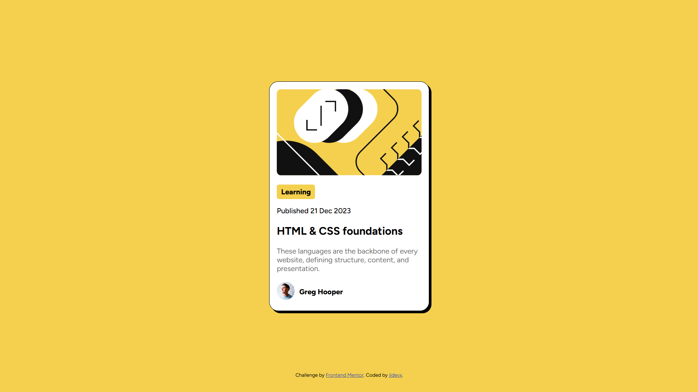

## Table of contents

- [Overview](#overview)
  - [Screenshot](#screenshot)
  - [Links](#links)
- [My process](#my-process)
  - [Built with](#built-with)
  - [What I learned](#what-i-learned)
- [Author](#author)8

## Overview

### Screenshot

### Links

- Live Site URL: [https://jldevx.github.io/blog-preview-card/](https://jldevx.github.io/blog-preview-card/)

## My process

### Built with

- Semantic HTML5 markup
- Flexbox
- SCSS
- clamp

### What I learned

This project helped reinforce my understanding of:

- The BEM naming convention
- Structuring reusable components using semantic HTML
- Mobile-first responsive design
- clamp

## Author

- Me
- Frontend Mentor - [@jldevx](https://www.frontendmentor.io/profile/jldevx)
